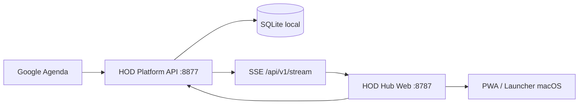

# HOD Hub

> Central operacional open source para consultorias, agenda, presença, disponibilidade e desempenho comercial.

[](https://nodejs.org/)
[](https://vite.dev/)
[](https://www.typescriptlang.org/)
[](LICENSE)

O HOD Hub transforma dados do Google Agenda em uma visão operacional única. O projeto reúne um frontend web responsivo e uma API central responsável por autenticação, calendário, regras de negócio, histórico, disponibilidade, resumo diário, Analytics e atualizações em tempo real.

## O que o projeto entrega

- **Início:** visão executiva do dia, próxima consultoria, pendências e atalhos.
- **Organograma do Dia:** Kanban operacional com busca, filtros, calendário, drag and drop e mudança manual de estado.
- **Horários Livres:** disponibilidade agrupada por faixa de horário, com os closers disponíveis em cada janela.
- **Resumo Diário:** qualificados, agendamentos, reuniões passadas, ocorridas, no-shows e reagendamentos.
- **Analytics:** ranking histórico por closer, períodos rápidos e intervalo personalizado.
- **Configurações:** aparência, sincronização e preferências da operação.
- **Sincronização:** leitura do Google Agenda e atualização manual padronizada em todas as telas.
- **PWA local:** manifest, service worker, launcher para macOS e servidor Express.

## Arquitetura



O frontend nunca é a fonte final das regras operacionais. A API centraliza normalização, classificação e histórico para que outros clientes possam consumir o mesmo estado.

## Stack

| Camada | Tecnologia |
| --- | --- |
| Interface | HTML, CSS e Vanilla JavaScript |
| Build | Vite 8 |
| Servidor web | Express 5 + Helmet |
| API | Node.js + TypeScript + Express |
| Persistência | SQLite com `better-sqlite3` |
| Integração | Google Calendar API |
| Tempo real | Server-Sent Events |
| Qualidade | ESLint, Prettier, Node Test Runner e smoke tests |

## Estrutura

```text
hod-hub/
├── app/                    # frontend e servidor web local
│   ├── production/         # páginas HTML
│   ├── public/             # PWA e recursos públicos
│   ├── server/             # servidor da porta 8787
│   ├── src/                # integração, componentes e estilos
│   └── scripts/            # smoke tests
├── api/                    # API operacional universal
│   ├── src/                # endpoints, domínio, banco e integrações
│   ├── test/               # testes da API e regras
│   └── docs/               # documentação técnica existente
├── docs/                   # documentação do produto
└── .github/                # CI e templates de colaboração
```

## Execução local

### Requisitos

- Node.js 20 ou superior
- pnpm
- credenciais OAuth do Google configuradas na API

### API

```bash
cd api
cp .env.example .env
pnpm install
pnpm run dev
```

A API usa `http://localhost:8877/api/v1` e publica a especificação OpenAPI em `/api/v1/openapi.json`.

### Frontend

```bash
cd app
pnpm install
pnpm run app
```

Abra `http://localhost:8787/production/inicio.html`.

## Validação

```bash
cd api
pnpm run typecheck
pnpm test
pnpm run build

cd ../app
pnpm run lint
pnpm test
pnpm run build
pnpm run smoke
```

## Regras operacionais essenciais

- Apenas **Compareceu** representa presença confirmada.
- **No-show** representa ausência e também pode ser derivado de recusa no Google Agenda.
- Reagendamentos permanecem no histórico para evitar perda da trajetória do lead.
- **Over** permanece separado dos closers e das taxas de no-show.
- Reunião passada significa que o horário já ocorreu e o evento foi destinado a um closer.
- Novo agendamento e reagendamento são classificados pelo histórico, não apenas pelo título atual.
- Datas e horários são tratados em `America/Sao_Paulo`.
- O administrador pode mover cards manualmente e reverter estados operacionais.

Leia [Regras de negócio](docs/business-rules.md) para o contrato completo.

## Segurança e privacidade

Este repositório não inclui banco operacional, tokens OAuth, cookies, logs, backups, dados de clientes ou arquivos `.env`. Use somente dados fictícios durante desenvolvimento e demonstrações públicas. Consulte [SECURITY.md](SECURITY.md).

## Documentação

- [Arquitetura](docs/architecture.md)
- [Instalação e configuração](docs/installation.md)
- [Regras de negócio](docs/business-rules.md)
- [API e integração](docs/api.md)
- [Validação](docs/validation.md)
- [Roadmap](docs/roadmap.md)
- [Como contribuir](CONTRIBUTING.md)
- [Changelog](CHANGELOG.md)

## Estado atual

O frontend oficial usa a direção visual Neutral Modern, possui temas claro e escuro, seleção de data consistente e layout responsivo. A API central oferece autenticação Google, calendário, disponibilidade, estados, equipe, configurações, resumo diário, Analytics, histórico e SSE.

## Licença

Distribuído sob a licença [MIT](LICENSE).

